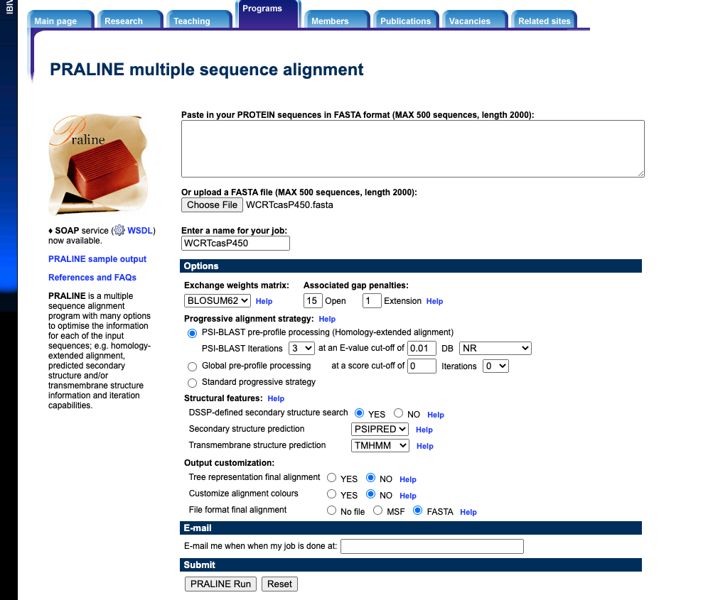
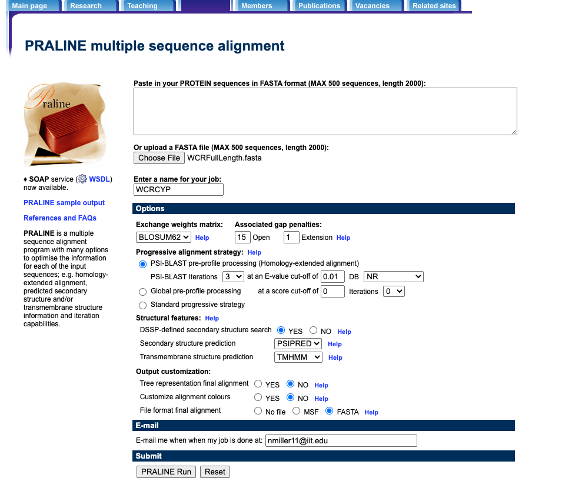

# Overview

Cytochrome P450s are assigned to families and subfamilies on the basis of amino acid identity. A CYP is a member of family X if it shares 40% amino acid identity with another member of family X. See *Feyereisen, René. “8 - Insect CYP Genes and P450 Enzymes.” In Insect Molecular Biology and Biochemistry, edited by Lawrence I. Gilbert, 236–316. San Diego: Academic Press* for details.

To assign our CYPs to families, we need to group them into clusters of >= 40% identity. To make life easier, we can also include CYPS from another species, with known family memberships. This should tell us right away which CYP family each cluster corresponds to.

Much of this analysis will make use of tools that cannot be easily run from the command line, so my preferred method of documenting analysis (run everything from a Makefile) breaks down. Instead, I will keep notes here, and track key files with git.

# Alignment

In some initial playing around, normal aligners (clustal, muscle, etc.) did not do a great job aligning the full-length CYPs we annotated. This is because CYPs are a highly divergent protein family. Fortunately, we can use praline, an aligner that takes into account regoins of high homology and structural similarity. In initial tests, pralinen did a much better job, in particular, the conserved cysteine heme-iron ligand signature motif `[FW]-[SGNH]-x-[GD]-{F}-[RKHPT]-{P}-C-[LIVMFAP]-[GAD]` aligned perfectly (except 2 sequences that turned out to be truncated) near the C-terminus and the transmembrane regions at the N-terminus mostly aligned.

Praline is not straightforward to install locally, but happily, it is available via a web interface: https://www.ibi.vu.nl/programs/pralinewww/

## Input sequences

### WCR

We have a total of 85 full-length manually curated sequences. To facilitate collaboration, the sequences were stored as fasta format in a Google Doc. They were downloaded, cleaned up (sequences unwrapped, DOS line breaks removed) and stored in `WCRFullLength.fasta`

### Tribolium

Tribolium P450 sequences were initially downloaded from NCBI. Fasta files of sequences were stored as Google Docs. Files were downloaded, cleaned up and stored under `Tcas/all/Tribolium_castaneum_CYP_*.fasta`. Files were edited by hand to include only one representative sequence per CYP family (the first sequence encountered from each family) and stored under `Tcas/1perFamily/Tribolium_castaneum_CYP_*.fasta`. A concatenated file with teh Tribolium P450 family representatives was stored under Tcas/TcasP450Families.fasta.

### Combined

Combined the WCR CYPs and the Tribolium family representatives together in file `WCRTcasP450.fasta`.

## Running PRALINE

Praline was run on `WCRTcasP450.fasta` via the web interface. All parameters were as default except that THMM was used to predict transmembrane regions. For reference, settings were captured in a screenshot:

Took a few hours to run. Results are stored in file `PralineResults20201119/alignment.fasta_ali`. Did visualization in Geneious - the conserved P450 motif aligns properly, so we appear to be in good shape.

## Re-running PRALINE

Ateempting to cluster and classify clusters into families using the 2020-11-18 WCR/Tribolium alignment revealed an issue. CYPs are classified into families on the basis of >=40% identity with another member of the family. This leads to a friends-of-friends situation, two protens may have <40% identity, but still be part of the same family because they both have >=40% identity with a third protein. This leads to a couple of related issues. Firstly, WCR proteins from the same CYP family may be split into > 1 cluster (although all memebers of a cluster should be from the same family. Secondly, an aritrary representative of a CYP family, taken from *Tribolium* will not necessarily cluster with WCR CYPs from the same family.

As an alternative approach, tried running PRALINE with just the 85 WCR full length CYPs. The plan will be to cluster these, and then assign to families by blasting representatives from each cluster against UniProt. As before, took a screenshot to document setting.

PRALINE results are stored in `PralineResults20201119/alignment.fasta_ali`.

# Clustering

This can be done fairly easily in R. The process is documented in R notebook `clustering.Rmd`, rendered in `clustering.nb.html`. The groups are recorded in file `WCRCYPGroups.tsv`.

# Assigning clusters to CYP families

Used blast searches with a representative from each cluster against the UniProt database (UniProtKb/Arthropoda). Need to be a bit cautious about what hits (if any) we use. Because sequences often get named for the nearest blast hit, and these names then get into the databases, something in the databases can be named for a particular CYP family without necessarily meeing the >=40% identity criterion.
To account for this hits were only used to confer CYP family if they came from a reliable source ("reviewed" proteins, *Tribolium* proteins), as well as meeting the >=40% identity requirement. Representative sequences were chosen by starting with the first sequence from each group, as listed in `WCRCYPGroups.tsv`. If no "reliable" blast hit with >=40% identity was found, the next sequence in thr group was tested. This was repeated until an acceptable hit was obrained or all sequences in the group had been tried, at which point, the group was considered unassigned.

Notes:

 * Group 5 hit to (Q964R0 reviewed Blatella CYP6) with 40.9% identity and D7EJT0 (Tribolium CYP345) with 51% identity, so assigned to CYP345.
 * Group 26 hit to two Tribolium CYP family members: D6WFY6 (CYP15) at 40.6% and A0A139WKQ2 (described as "Putative cytochrome P450 303a1-like Protein") at 57.9%. Given the tenetative nature of the latter, assigned group 26 to CYP15.

Results are in `WCRCYPGroupsFamilies.tsv`
