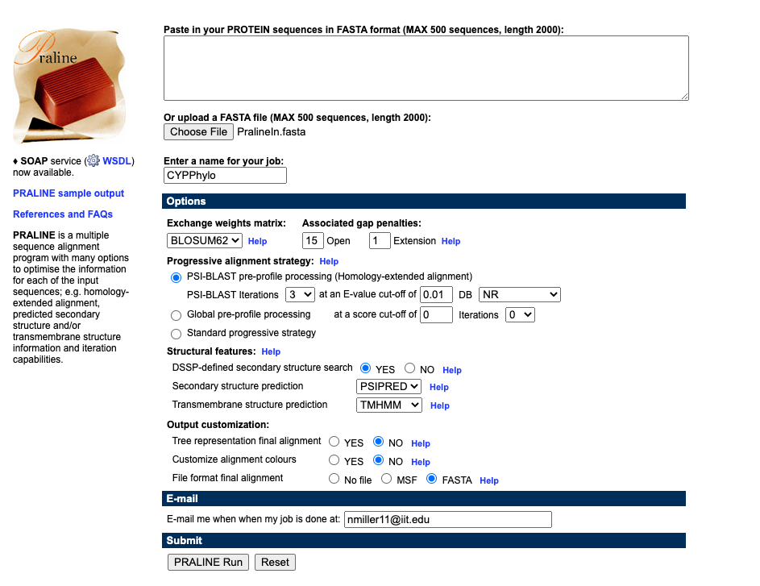
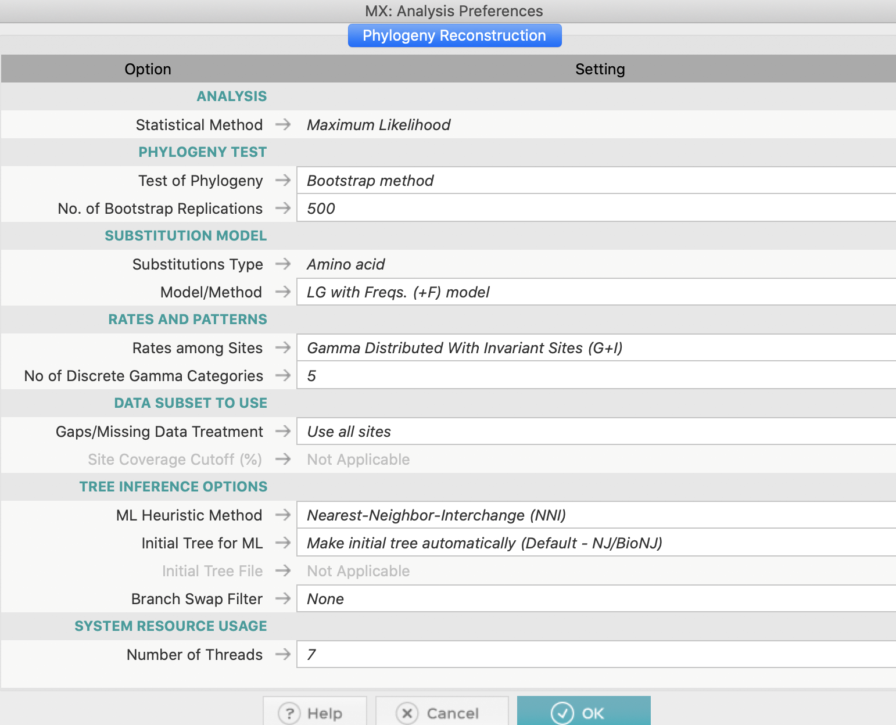

# Constructing a phylogeny of P450s

For simplicity, we will follow the same methodoloty Brad already used for the ABC transporters. Use MEGA to first determine the best substitution model, then use that model to produce a maximum likelihood tree.

One question - do we include non-WCR CYPs as reference points? May not be necessary, given we have already assigned the CYPs to families. If we do add in external references, we will need to re-align. After some conversation with Brad, decided to add some reference points. Selected the UniProt blast hits used to assign full-length genes to CYP families (see `../clustering`).

## Aligning P450s

Made an input fasta file (`PralineIn.fasta`) by combining the 85 full-length WCR P450s (`WCRFullLength.fasta`) plus the 20 UniProt blast hits (`UniProtFamilyReps.fasta`).

Ran PRALINE via the web interface at https://www.ibi.vu.nl/programs/#msa. Took a screen shot to record the parameters

PRALINE alignment was stored in `PralineResults20201221/alignment.fasta_ali`. Because PRALINE likes to change various chracters to underscores, made a copy of the alignment, with original names restored as `PralineOut.fasta`

## Model selection for ML Tree

MEGA has a tool to select the best amino acid substitution model for maximum likelihood trees. Rand this tool and save the output to `MEGAModelSelection.txt`

## ML Tree

Lowest BIC was for model "LG+G+I+F" (LG with freqs, gammma distributed rates with invariant sites). Used this model to make the ML tree. Ran MEGA to buit the ML tree with 500 bootstrap replicates.

Because MEGA is GUI based, took a screenshot to capture paramter settings (did this after analysis was done, but I'm confident params were the same).

NEWICK formatted tree saved to `MEGAMLTree20201229.nwk`
